# 电商风险控制系统 — 架构设计（ARCHITECTURE）

| 项目 | 内容 |
| --- | --- |
| 文档版本 | v1.0 |
| 编写日期 | 2026-09-23 |
| 上游文档 | `docs/PRD.md`（需求与分期）、`docs/DESIGN.md`（UI 规范） |
| 本文范围 | **只回答"怎么做"**：分层、模块、数据流、关键机制、决策取舍、部署与测试 |
| 目标读者 | 作者本人（答辩/维护）、后续接手者 |
| 图形约定 | Mermaid 代码块（GitHub / VS Code Markdown 预览可直接渲染） |

---

## 1. 架构目标与约束

架构不是自由设计，是被下面这组约束推出来的。每条约束都会在 §15 的 ADR 里对应一个决策。

| 类别 | 约束 | 对架构的直接影响 |
| --- | --- | --- |
| 性能 | 决策 P95 < 50ms；特征计算 < 20ms | 决策主链路**禁止同步写 MySQL**；特征窗口必须走内存级存储（Redis） |
| 正确性 | 判定必须可解释、可复算 | 规则分/模型分/综合分三分留存；规则求值逐条留痕 |
| 幂等 | 业务方可能重试投递 | `event_id` 唯一约束 + Redis 结果缓存，重复投递返回首判 |
| 可审计 | 处置与策略变更不可篡改 | 审计日志只增不改 + SHA-256 前向哈希链 + 独立校验接口 |
| 可复现 | 演示与答辩需可重复 | 固定随机种子；模型是**文件**而非服务；场景脚本可重放 |
| 可维护 | 单人维护、长期演进 | 单向依赖分层；特征/规则/配置集中注册；配置一律入 `sys_config` |
| 环境 | 本地单机（本地托管 MySQL/Redis） | 单实例部署模型；不引入 MQ / 容器编排 |

**明确的架构反目标**：不追高可用、不做水平扩展、不做多租户、不做不停机热升级。为了让 P0 尽快可验证，宁可单实例简单直接。

### 1.1 图形规范（Mermaid 约定）

本文所有架构图用 Mermaid 代码块嵌入（GitHub / VS Code 预览可直接渲染）。为让十几张图风格统一、语义不歧义，约定如下（颜色与 `docs/DESIGN.md` 同源）：

| 约定 | 取值 |
| --- | --- |
| 形状语义 | 外部参与者＝圆角 `( )`；本系统组件＝直角 `[ ]`；数据存储＝圆柱 `[( )]`；决策＝菱形 `{ }`；起止＝胶囊 `([ ])` |
| 前端层 | 填充 `#e6f4ff` / 描边 `#1677ff` / 文字 `#0958d9` |
| 后端层 | 填充 `#f9f0ff` / 描边 `#722ed1` / 文字 `#531dab` |
| 数据层 | 填充 `#fffbe6` / 描边 `#faad14` / 文字 `#ad6800` |
| 离线脚本层 | 填充 `#f6ffed` / 描边 `#52c41a` / 文字 `#237804` |
| 风险/阻断语义 | 填充 `#fff2f0` / 描边 `#ff4d4f` / 文字 `#cf1322` |
| 单图节点上限 | ≤ 20 个，超出即拆分视角 |
| 边标签 | ≤ 12 个汉字，必要时 `<br/>` 换行，避免压线 |
| 图例 | 统一由本节色板表承担，**图内不重复绘制图例子图**（避免挤占单图节点预算） |
| 节点统计 | 不含子图标题；§3=16、§4=19、§2.1=13、§6.3=15，均 ≤ 20 |
| 中文 | 节点标签一律中文（技术标识除外），字体交给渲染器 |

---

## 2. 系统分层与上下文（C4-L1）

### 2.1 分层架构视图

先看"有哪几层、谁调用谁"，再看外部上下文。四层单向依赖，**决策层不碰 MySQL** 是性能约束的直接体现（§12）。

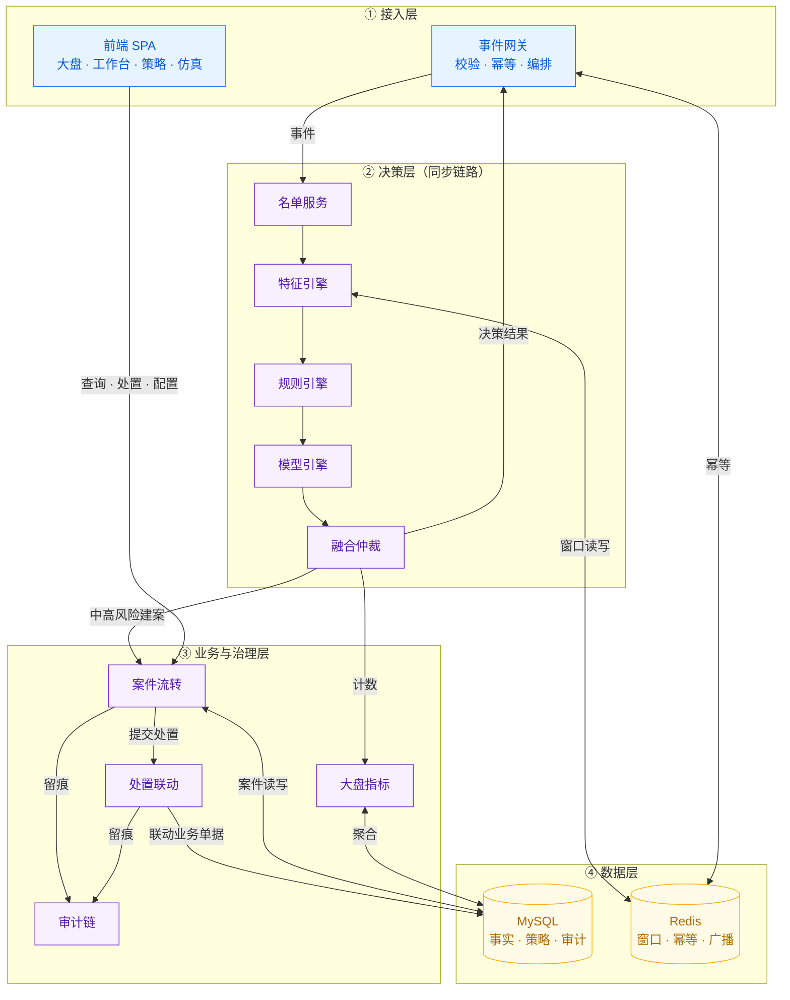

### 2.2 系统上下文图

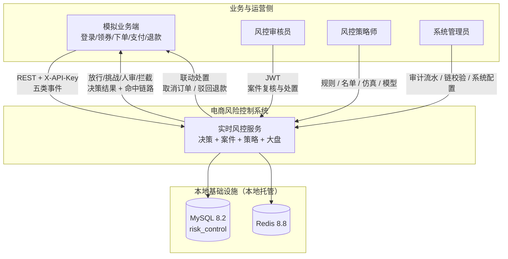

要点：
- 业务侧与运营侧是**两条独立鉴权通道**（API Key / JWT），在审计日志中可区分机器调用与人工操作。
- 处置联动是"风控 → 业务"的反向写，是本系统能演示闭环的关键（PRD §9.4）。

---

## 3. 容器视图（C4-L2）

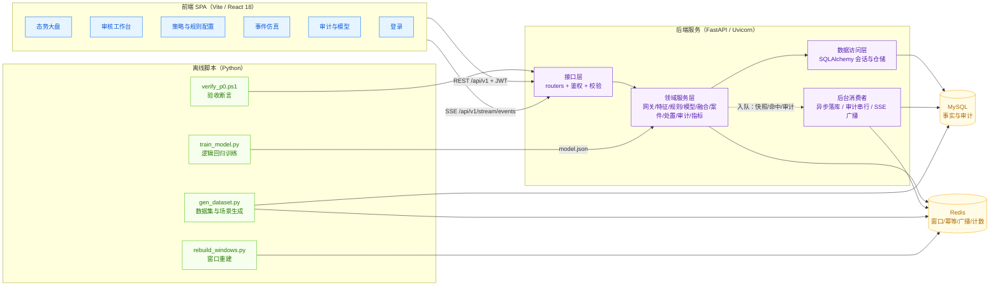

进程与端口：

| 容器 | 技术 | 端口 | 备注 |
| --- | --- | --- | --- |
| 前端 dev server | Vite | 5173 | `/api` 代理到 8000 |
| 后端服务 | Uvicorn + FastAPI | 8000 | REST + SSE；单 worker（见 ADR-13） |
| 单端口演示 | FastAPI 静态托管 `frontend/dist` | 8000 | 答辩模式，只需一个地址 |
| MySQL | 本地实例 | 3306 | 库 `risk_control` |
| Redis | 本地实例 | 6379 | 逻辑库 0 |

---

## 4. 后端组件视图（C4-L3）

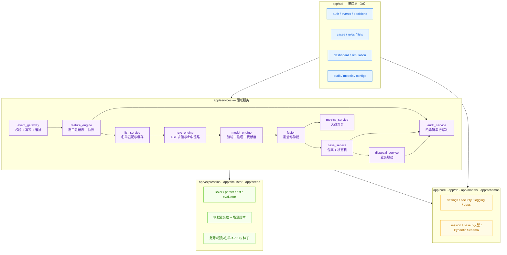

**依赖方向是单向的**：`api → services → (expression | models) → core`。禁止反向引用（服务层不得 import router），禁止跨服务直接读对方的表（如需跨域数据，走对方的 service 方法）。这条规则是单人维护代码库不腐化的最低成本保障。

模块职责与关键实现点：

| 模块 | 职责 | 关键实现点 |
| --- | --- | --- |
| `event_gateway` | 事件接入的唯一入口 | 幂等判定 → 名单 → 特征 → 规则 → 模型 → 融合 → 响应 + 异步落库 |
| `feature_engine` | 特征计算 | 特征注册表（声明式）；Redis ZSET 事件条带；缺失字段告警 |
| `list_service` | 名单匹配 | 五维度并行匹配；进程内 LRU + Redis 兜底缓存；写后主动失效 |
| `rule_engine` | 规则求值 | 编译结果按 `code@version` 缓存；输出全量求值链路（含未命中） |
| `model_engine` | 模型推理 | 加载 `model.json`；原子热切换；贡献度 top-5 |
| `fusion` | 融合仲裁 | 三分留存；模式可配；Challenge 由 `action_hint` 决定 |
| `case_service` | 合案与状态机 | 合案键 + 窗口；乐观锁条件更新 |
| `disposal_service` | 处置联动 | 业务结论与风控动作分别落地；联动失败不阻塞 |
| `audit_service` | 审计 | 单消费者串行；哈希链；校验算法 |
| `metrics_service` | 大盘 | Redis 实时计数 + MySQL 预聚合 |

---

## 5. 运行时视图

### 5.1 事件决策主链路（同步与异步的边界在哪）

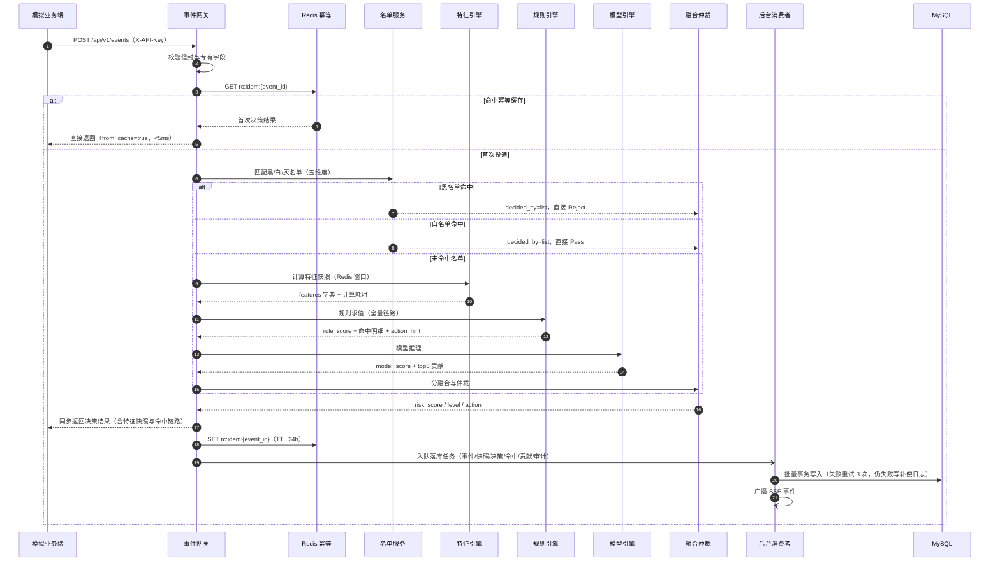

**边界原则**：同步段只碰内存与 Redis（毫秒级）；一切 MySQL 写入走队列。这样即便数据库抖动，决策接口也不超时——代价是"大盘数据比真实决策晚几十毫秒"，已在 PRD §18 记录并接受。

### 5.2 案件处置链路

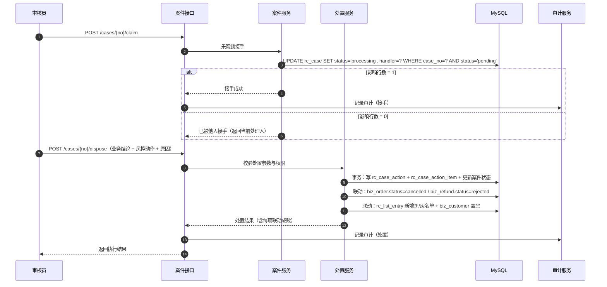

### 5.3 案件状态机

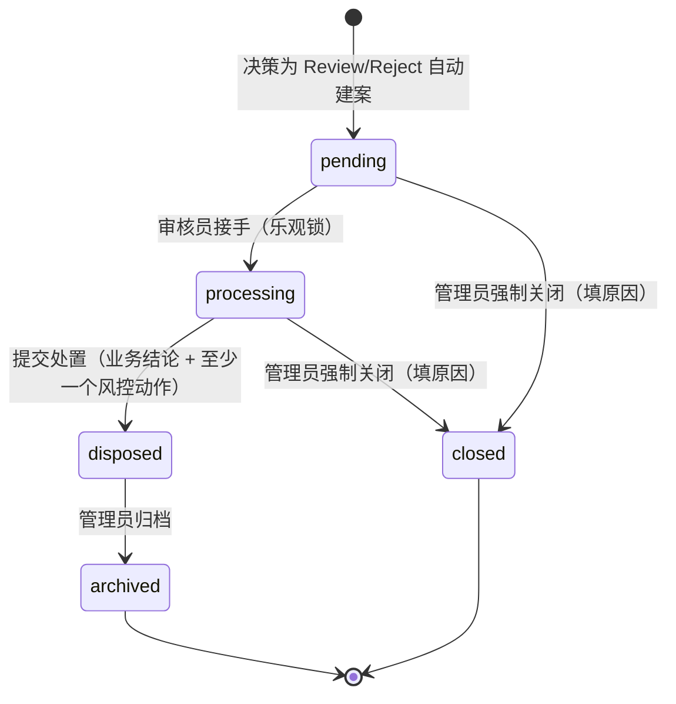

### 5.4 大盘与 SSE 数据流

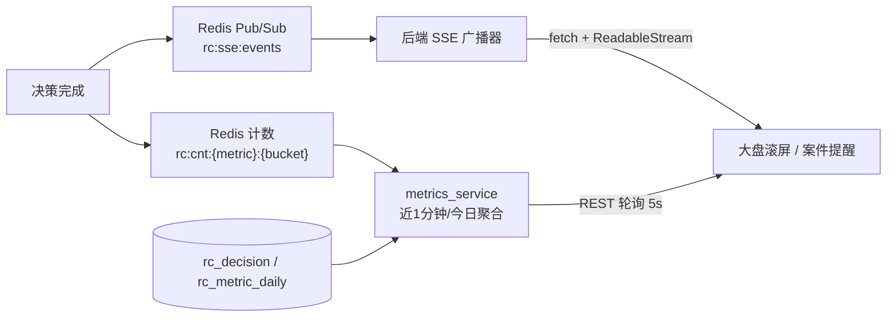

拆分理由：**滚屏用推送（低频、要求实时），指标卡用轮询（可容忍 5 秒延迟）**。指标卡若也走 SSE，每次决策都要重算聚合并推送，成本高于收益。

---

## 6. 数据架构

### 6.1 存储分层

| 层 | 前缀 | 内容 | 生命周期 |
| --- | --- | --- | --- |
| 系统层 | `sys_` | 账号、配置、API Key | 永久 |
| 业务层 | `biz_` | 用户、商品、订单、退款、领券记录 | 永久（模拟业务数据） |
| 风控事实层 | `rc_` | 事件、快照、决策、命中、贡献、案件、处置 | 永久 |
| 风控策略层 | `rc_` | 规则、规则版本、名单、模型版本 | 永久 |
| 审计层 | `rc_audit_log` | 哈希链审计 | 永久只增 |
| 监控层 | `rc_metric_daily` | 日聚合指标 | 永久 |

### 6.2 Redis 键空间设计

| 用途 | 键模式 | 结构 | TTL | 说明 |
| --- | --- | --- | --- | --- |
| 特征窗口（事件条带） | `rc:evt:{entity}:{id}:{eventType}:{window}` | ZSET | 窗口 + 10min | member = `{ts_ms}|{event_id}|{amount}|{subject}`，score = `ts_ms`（`subject` 见下） |
| 幂等结果 | `rc:idem:{event_id}` | STRING(JSON) | 24h | 命中即返回首判 |
| 名单缓存 | `rc:list:{dimension}:{listType}` | SET | 60s | 写名单后主动 DEL |
| 实时计数 | `rc:cnt:{metric}:{bucket}` | STRING(INCR) | 2h | bucket = `yyyyMMddHHmm` |
| 规则编译缓存 | 进程内 LRU（非 Redis） | dict | — | 按 `code@version` 键 |
| SSE 广播 | `rc:sse:events`（Pub/Sub channel） | pub/sub | — | 单实例也走它，便于将来多实例 |
| 模型热切换信号 | `rc:model:active` | STRING(version) | 无 | 切换后各实例比对刷新 |

**为什么用 ZSET + 编码 member 而不拆成"计数器 + 求和器"**：一个结构同时支持按时间范围 `ZCOUNT`（计数）与 `ZRANGEBYSCORE` 后解析金额求和（金额），且因为 `member` 含 `event_id`，重复投递天然不重复计数（集合语义带来免费去重）。代价是金额求和需拉取窗口内成员，实测 24h 窗口内单实体事件量为百级，成本可接受。

**`subject` 段（P0 落地补入，详见 §19.5）**：第四个字段承载"这条事件属于哪个主体"（如 `user:U1`），供聚簇特征（同设备/同 IP 关联账号数）去重；不需要去重的维度写空串。**它必须独立成段、不能覆盖 `event_id` 位**——同一个键同时服务"数事件条数"与"数不同主体"两类特征，覆盖会让前者把同一主体的多次事件折叠成一个成员，计数静默减半。

**内存估算**：5 万事件 × 平均 9 个键条目 ≈ 45 万 ZSET 成员，按每成员约 80B（含 Redis 开销）估算 ≈ 36MB，叠加 TTL 自动淘汰，量级安全。

### 6.3 领域实体关系（核心 rc_ 域）

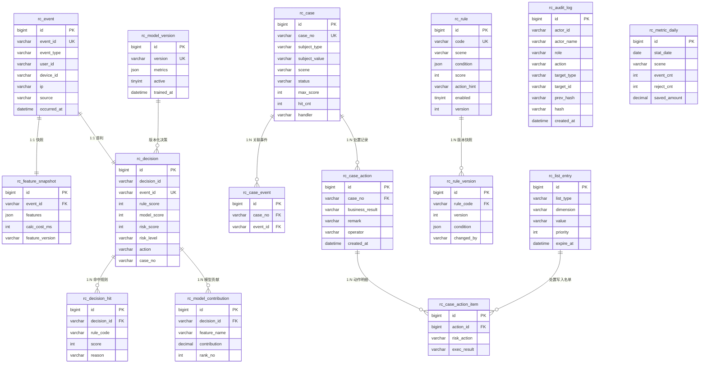

图中仅列关键字段（完整字段、类型与索引见 `docs/PRD.md` 附录 A）。其中 `rc_audit_log` 是链式只增表（`prev_hash → hash`），不与业务表建外键；`rc_metric_daily` 为派生聚合表，同样无外键关系；`biz_*` 与 `sys_*` 为支撑域，不在此图。

### 6.4 读写路径与索引策略

| 路径 | 访问模式 | 索引/优化 |
| --- | --- | --- |
| 事件接入 | 按键判重 + 单条插入 | `rc_event(event_id)` 唯一 |
| 特征计算 | Redis 范围查询 | 键设计见 6.2；不涉 MySQL |
| 决策查询 | 列表筛选（类型/动作/时间/主体） | `rc_decision(created_at)`、`rc_decision(event_id)` 唯一 |
| 案件列表 | 多维筛选 + 分页 | `rc_case(status, created_at)`、`rc_case(subject_value, scene, status)` |
| 案件详情 | 按案件号聚合事件/命中/图谱 | `rc_case_event(case_no)`、`rc_feature_snapshot(event_id)` |
| 名单匹配 | 五维度点查 | `rc_list_entry(list_type, dimension, value)` 唯一 |
| 大盘趋势 | 时间范围聚合 | `rc_metric_daily(stat_date, scene)`，实时部分走 Redis |
| 规则命中排行 | 今日分组统计 | `rc_decision_hit(rule_code)` + 时间过滤（P2 视数据量加预聚合） |

**N+1 防范**：案件列表页所需的风险标签、命中次数、最高分直接冗余在 `rc_case`（写入时算好），避免列表页逐条回查 `rc_decision_hit`。

### 6.5 一致性与幂等

| 场景 | 策略 |
| --- | --- |
| 事件重复投递 | `event_id` 唯一约束（DB 兜底）+ Redis 幂等缓存（快速路径）+ 首判结果回放 |
| 决策响应与落库 | 响应同步返回，落库异步；失败重试 3 次（指数退避），仍失败写 `logs/write_failure.log`；`/healthz` 暴露失败计数；`scripts/replay_write_failures.py` 支持重放 |
| 并发接手案件 | 乐观锁条件更新，`affected_rows=0` 即冲突并返回当前处理人 |
| 审计链顺序 | 单消费者串行写入，保证 `prev_hash` 连续（见 §7.7） |
| Redis 数据丢失 | 从 `rc_event` 回溯重建窗口（`scripts/rebuild_windows.py`）；Redis 视为可丢缓存 |
| 模型版本切换 | 先写库再发 Redis 信号，各实例比对后原子替换内存引用，切换不影响在途决策 |

---

## 7. 关键机制设计

### 7.1 特征引擎

**声明式注册表**是这块的核心设计：新增特征只加一条声明，不写流程代码。

```python
# 概念示意（真实实现落在 app/services/feature_engine.py）
FEATURE_REGISTRY = [
    FeatureSpec(
        key="device_account_cnt",
        entity="device",                 # 归因实体：user / device / ip / address / phone
        event_types=["login", "coupon_receive", "order_create", "order_pay"],
        windows=["24h", "7d"],           # 窗口档位
        agg="distinct",                  # distinct 按 user_id 去重计数
        distinct_field="user_id",
    ),
    FeatureSpec(
        key="user_coupon_amount",
        entity="user",
        event_types=["coupon_receive"],
        windows=["24h"],
        agg="sum",
        amount_field="face_value",
    ),
]
```

求值流程：按 `entity + id + eventType + window` 拼键 → `ZCOUNT`（计数）或 `ZRANGEBYSCORE` 求和（金额）→ 写入特征字典 → 计算耗时与缺失字段清单 → 生成快照 JSON。

边界处理：实体字段为空（如事件无地址）→ 该组特征全部返回 0 并在 `missing_fields` 记录；窗口边界使用**事件自身时间戳**而非服务器当前时间，保证历史数据重放结果与实时一致（这是演示可复现的前提）。

### 7.2 规则表达式引擎

三阶段：**文本 → AST → 求值**，AST 是唯一真源（树编辑器与文本编辑器都产出/消费它）。

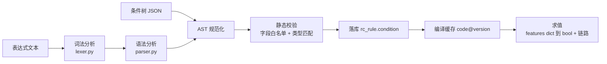

AST 结构：

```json
{
  "op": "and",
  "children": [
    { "op": "condition", "field": "device_account_cnt_24h", "cmp": ">=", "value": 3 },
    { "op": "not", "children": [
      { "op": "condition", "field": "subject_blacklist", "cmp": "==", "value": true }
    ]}
  ]
}
```

安全边界（这是自研求值器而非 `eval` 的全部理由）：
- 词法层只接受标识符、数字、字符串、布尔、`in`/`between` 关键字与括号，**任何函数调用、属性访问、赋值语法直接语法错误**。
- 字段名必须命中特征注册表白名单；未注册字段在保存时即报错，不允许入库。
- 类型检查：数值比较要求两边均为数值（或可安全转换）；字符串仅允许 `==`/`!=`/`contains`/`matches`。
- 求值是纯函数，不接触会话、不触发 IO，天然可单测。

求值输出不只是布尔值，而是**全量链路**（规则命中排行与仿真页都依赖它）：

```json
{
  "rule_code": "RC_ENV_001",
  "hit": true,
  "score": 30,
  "leaf_results": [
    { "field": "device_account_cnt_24h", "cmp": ">=", "value": 3, "actual": 7, "result": true },
    { "field": "account_age_days", "cmp": "<", "value": 7, "actual": 12, "result": false }
  ],
  "missing_fields": [],
  "reason": "同设备 24h 关联 7 个账号（阈值 3）"
}
```

### 7.3 模型引擎

**训练侧（离线脚本，不属于运行时）**

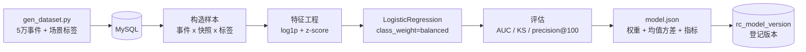

**模型文件契约**（运行时唯一输入，字段固定便于校验）：

```json
{
  "version": "v1",
  "trained_at": "2026-09-23T10:00:00Z",
  "feature_names": ["device_account_cnt_24h"],
  "log1p": true,
  "mean": [0.0],
  "std": [1.0],
  "weights": [0.82],
  "intercept": -2.31,
  "metrics": { "auc": 0.94, "ks": 0.71, "precision_at_100": 0.88, "samples": 50000 },
  "label_definition": "作弊场景脚本产生的账号事件为正样本"
}
```

**在线侧**：启动加载 → 原子引用替换 → 推理 `z = Σ w_i·z_i + b` → `sigmoid` → ×100；贡献度 `contrib_i = w_i · z_i`，排序取 top-5（正负号即方向）。缺失特征用 `mean` 填充并在响应中标记 `imputed_fields`，避免"悄悄给一个 0 值"这种不可解释行为。

**版本切换**：`GET/POST /api/v1/models`；切换时先写 `rc_model_version.active`，再置 `rc:model:active`，实例比对后替换内存对象引用（读路径无锁，靠引用赋值原子性）。旧版本文件保留在 `backend/models_artifacts/`，可回切。

### 7.4 融合与仲裁

```
rule_score  = min(sum(hit.score), 100)                 # 单规则最多计一次
model_score = round(100 * sigmoid(w.z + b))            # 无启用模型时为 0 并标记 model_disabled
risk_score  = clamp(round(rule_score + alpha * model_score), 0, 100)   # alpha 默认 0.3，可配

if decided_by == "list":        action = 名单结论（Reject / Pass）
elif risk_score >= 80:          action = Reject  + 建案
elif risk_score >= 60:
    action = Challenge if any(hit.action_hint == "challenge") else Review  (+ 建案)
else:                           action = Pass
```

融合模式由 `sys_config.fusion_mode` 决定（`additive` 默认 / `max` / `weighted`），上式是 `additive` 形态。

三个分与 `decided_by` 全部落库——审核员看到的"系统判定摘要"就是这几个值；被问"为什么是 87 分"时可直接展开：哪几条规则贡献了多少、模型贡献了多少。

### 7.5 名单匹配

- 匹配维度：user / phone / ip / device / address，取值来自事件信封（`user_id` / `phone` / `network.ip` / `device.device_id` / `address.address_hash`）。
- 缓存：进程内 LRU（上限 5 万条，O(1)）→ 未命中查 Redis SET → 未命中查 MySQL 并按维度整表回填。
- 失效：名单写操作后 `DEL rc:list:{dimension}:{listType}` + 清进程内 LRU；TTL 60s 兜底。
- 有效期：`expire_at` 非空且已过期视为未命中；匹配时忽略过期项而非物理删除（保留证据）。
- 冲突：黑白同时命中 → 读 `sys_config.list_conflict_policy`，默认 `black_first`；两者均记录在决策明细中。

### 7.6 合案与状态机

```sql
-- 合案：找窗口内同主体同场景的未结案件
SELECT case_no, hit_cnt, max_score
FROM rc_case
WHERE subject_type = ? AND subject_value = ? AND scene = ?
  AND status IN ('pending', 'processing')
  AND last_at >= ?                  -- now - case_merge_window_minutes
ORDER BY last_at DESC
LIMIT 1
FOR UPDATE;                         -- 行锁防并发重复建案
```

命中则累加（`hit_cnt+n`、`event_cnt+1`、`max_score=GREATEST(max_score,?)`、`last_at=GREATEST(last_at, occurred_at)`）并写 `rc_case_event`；未命中则新建案件（案件号 `C{yyyyMMddHHMMSS}{进程盐}{6位序号}`）。

**P1 实装的两点修正（与本节初稿的差异，详见 §19.8）**：

1. **窗口锚点用事件业务时间 `occurred_at` 而不是 `now()`**：窗口回答的是"这两次触发在业务上
   算不算同一起事件"，与风控什么时候收到它无关；用处理时刻做锚点时，补投递与时钟偏差会让
   合案结果随"服务器负载 / 重试延迟"漂移。
2. **`last_at` 取 `GREATEST` 而不是直接赋值 `now`**：晚到的补投递事件不能让末次触发时间
   倒退，否则下一次合案判断会把窗口算到过去，凭空多出一个案件。

案件编号也是同一条教训的第二次应用：初稿的 `RC{yyyyMMdd}{6位序列}` 依赖"当日内序列"，
而决策编号曾经因为"秒级时间戳 + 3 位随机后缀"在同秒并发下撞唯一索引（见 §19.5），
案件编号因此直接沿用已验证的三段式（时刻 + 进程盐 + 进程内自增序号）。

关于 `SELECT ... FOR UPDATE` 的**能力边界**：候选案件存在时它能正确串行化累加；
候选案件不存在时没有任何行可锁 —— 两个并发请求会各自查到"无候选"，然后各建一个案件。
MySQL 在 REPEATABLE READ 下确实会对索引区间加间隙锁，但锁范围取决于执行计划
（一旦优化器选择全表扫描就完全不同），把它当作**主要**保障是在赌执行计划。
P1 的实装因此分两层：**进程内按 `(主体, 场景)` 加锁**（主要保障，结论确定）
+ `FOR UPDATE` 与 `hit_cnt = hit_cnt + n` 的原子累加（第二层，保证多进程下不丢更新）。
多进程下"重复新建案件"仍是已知限制，正解是"活跃案件唯一键"或 `GET_LOCK`（见 §16）。

状态迁移一律用**条件更新**（乐观锁）而非"先查后改"，这是并发正确性的关键：

```sql
UPDATE rc_case
   SET status='processing', handler=?, claimed_at=NOW()
 WHERE case_no=? AND status='pending';   -- affected_rows=0 即冲突
```

### 7.7 审计哈希链

```
prev = (SELECT hash FROM rc_audit_log ORDER BY id DESC LIMIT 1) 或 GENESIS
payload = canonical_json({actor_id, actor_name, role, action, target_type, target_id, before_json, after_json, reason, created_at})  # 字段名与 rc_audit_log 表一致
hash = sha256(prev + payload)
```

- **串行化**：审计写入由单消费者协程处理（`asyncio.Queue`），单实例下天然保序；多实例扩展需换 DB 行锁或分布式锁（见 §16）。
- **规范化 JSON**：键排序、时间统一 ISO8601 UTC、空值统一 `null`——否则同样的业务内容会算出不同哈希，链会"假断裂"。
- **不可篡改**：应用账号对 `rc_audit_log` 只授 `INSERT`/`SELECT`；另加 `BEFORE UPDATE` / `BEFORE DELETE` 触发器 `SIGNAL SQLSTATE '45000'` 兜底（已随 P0 迁移创建）。
- **演示方式**：触发器对所有账号生效且 MySQL 不支持禁用触发器，故演示"链断裂检测"需先 `DROP TRIGGER` → 改一行 → 调校验接口 → 重建触发器。这反而更能说明纵深防御：第一层挡住直接篡改，绕过第一层后第二层仍然发现。
- **已知限制**：本项目以 `root` 连接，`INSERT/SELECT` 授权这一层当前不生效（详见 docs/PRD.md §10.2 实现口径）。哈希链与触发器两层不受影响。
- **校验**：`GET /api/v1/audit/verify` 从 `GENESIS` 顺序重算，遇第一条不匹配即返回 `first_broken_id`。演示脚本会用有权限的账号故意 `UPDATE` 一条记录再调校验接口，展示断裂检测。

### 7.8 大盘与 SSE

- **实时计数**：决策完成时 `INCR rc:cnt:{metric}:{yyyyMMddHHmm}`（总数、各动作数），TTL 2h。近 1 分钟指标 = 当前与前一分钟的桶求和（避免边界丢数）。
- **广播**：决策完成后 `PUBLISH rc:sse:events <精简JSON>`；SSE 广播器订阅该 channel 并推给所有在线连接。单实例也走 Redis Pub/Sub，是为将来多实例留的一致路径。
- **连接管理**：每连接注册 `asyncio.Queue(maxsize=200)`，队列满时丢弃最旧消息（滚屏场景丢帧优于阻塞决策线程）；30s 心跳注释帧防代理断连。
- **前端订阅**：原生 `EventSource` **无法设置请求头**，因此前端用 `fetch` + `ReadableStream` 手写 SSE 解析，从而携带 `Authorization: Bearer`，避免把 token 暴露在 URL 查询串里。断线按 1s/2s/4s/8s 退避重连，恢复后提示"已恢复"。

---

## 8. 前端架构

```
frontend/src/
├─ api/          client.ts（fetch 封装 + 401 拦截）/ sse.ts（流式 SSE）/ hooks（TanStack Query）
├─ store/        auth.ts（token + 角色）、ui.ts（筛选条件、大盘开关）
├─ layouts/      MainLayout（侧边栏 + 顶栏 + 角色菜单 + SSE 提示条）
├─ router.tsx    路由表 + RoleGuard
├─ pages/        Login / Dashboard / ReviewWorkbench / PolicyConfig / Simulation / AuditModel
├─ components/   EvidencePanel / ProfileCard / EntityGraph / ConditionTreeEditor /
│                RuleHitTable / ModelContributionChart / RiskTag / ActionTag / StateTag
├─ theme/        tokens.ts / semantic.ts / charts.ts / layout.ts   ← 对应 docs/DESIGN.md
└─ types/        与后端 Pydantic Schema 对齐的 TS 类型
```

| 关注点 | 方案 | 理由 |
| --- | --- | --- |
| 服务端状态 | TanStack Query（列表/详情/指标） | 自带缓存、重试、加载与错误态，省掉手写样板 |
| 全局状态 | 仅认证与 UI 开关（轻量 store） | 业务数据都在 Query 缓存里，不重复存一份 |
| 路由权限 | `RoleGuard` 包裹路由 + 菜单按角色生成 | 前端只做体验，真正的边界在后端 |
| 实时推送 | `sse.ts` 单连接复用，按 topic 分发 | 避免每页各开一条连接 |
| 图表 | 统一封装 `EntityGraph` / `TrendChart` + `charts.ts` 色板 | 保证 DESIGN.md 语义色一致 |
| 条件编辑器 | 树编辑为主、文本编辑为辅，共用后端 AST 校验接口 | 保存前调 `/rules/validate` 试算，非法规则不入库 |
| 表格与筛选 | 列表参数与 URL query 同步 | 刷新/分享可复现同一视图（答辩演示友好） |
| 视觉规范 | 全部取自 `theme/`，页面内禁止硬编码色值 | 后续改 `DESIGN.md` 时只改 token |

---

## 9. 接口架构

**统一响应**：

```json
{ "code": 0, "message": "ok", "data": { }, "trace_id": "..." }
```

**错误码分段**：`0` 成功；`400xx` 参数与校验（含字段路径）；`401xx` 鉴权失败；`403xx` 权限不足；`404xx` 资源不存在；`409xx` 冲突（幂等冲突、案件已被接手）；`500xx` 服务端异常。

**分层职责**：router 只做"取参 + 鉴权依赖 + 调 service + 组装响应"，**不含业务逻辑**；service 抛领域异常（`BusinessError` 子类），由全局异常处理器统一映射错误码——保证所有接口错误结构一致。

**分页约定**：请求 `page`/`size`（默认 1/20，上限 100），响应 `{ items, total, page, size }`。

---

## 10. 安全架构

| 面 | 措施 |
| --- | --- |
| 双通道鉴权 | 业务侧 `X-API-Key`（哈希存储、可启停、记录最近调用）；运营侧 JWT(HS256, 7 天) |
| 权限边界 | FastAPI 依赖注入做接口级校验（角色矩阵见 PRD §4.2）；前端仅配合显隐 |
| 密码 | bcrypt 摘要；预置账号仅用于演示，README 明确提示 |
| 注入 | SQLAlchemy 参数化；规则表达式白名单求值（无 `eval`）；名单导入做字段与长度校验 |
| 审计不可篡改 | 只增表 + DB 权限 + 触发器 + 哈希链校验 |
| 敏感信息 | API Key 只存哈希；日志脱敏（手机号中间四位、token 截断）；`.env` 不入库 |
| 传输 | 本地 HTTP；对外暴露必须置于 HTTPS 之后（部署前提，非本期范围） |
| SSE | token 走 Authorization 头（fetch 流式实现），不进 URL；同源校验 |

**哈希算法分族（P0 落地确认）**：口令用 bcrypt（低熵、需抗离线爆破）；API Key 用 SHA-256（32 字节随机、高熵不可爆破），且摘要确定，可建唯一索引做等值查找。给 API Key 上 bcrypt 会给每次事件接入加约 250ms，直接违背 §12 的 P95 指标。实现见 `backend/app/core/security.py`。

---

## 11. 可观测性

| 项 | 内容 |
| --- | --- |
| 结构化日志 | JSON 行，字段：`ts / level / module / trace_id / decision_id / event_id / cost_ms / msg` |
| 决策追踪 | `decision_id` 贯穿接入 → 特征 → 规则 → 模型 → 融合 → 落库，一条命令可捞出整条链路 |
| 关键埋点 | 决策耗时、各阶段耗时、名单命中、规则命中数、模型分分布、落库失败数、SSE 连接数 |
| 健康检查 | `GET /healthz`：MySQL/Redis 连通性、后台队列积压、落库失败计数、当前模型版本 |
| 依赖降级 | Redis 不可用：窗口特征退化为 0 并标记 `feature_degraded`（决策仍可返回，但风险分偏低需提示）；MySQL 不可用：接入接口返回 503（避免"判了但存不下"） |
| 排障手册 | README 收录常见故障（Redis 未启动 / 库不存在 / 端口占用 / SSE 不推）与处置步骤 |

---

## 12. 性能与容量

**决策 P95 < 50ms 的时间预算分解**（本地单机）：

| 阶段 | 预算 | 手段 |
| --- | --- | --- |
| 接入校验 | 3ms | Pydantic v2 编译期校验，避免逐字段反射 |
| 幂等查询 | 2ms | Redis GET 单次往返 |
| 名单匹配 | 2ms | 进程内 LRU 优先，Redis 兜底 |
| 特征计算 | 15ms | ZSET 批量 pipeline，一次往返取多特征 |
| 规则求值 | 5ms | 编译结果缓存 + 纯内存求值 |
| 模型推理 | 2ms | 20 维线性计算，预取均值方差 |
| 融合与序列化 | 2ms | 无 IO |
| 余量 | 19ms | 抖动、GC、日志 |
| **合计** | **50ms** | 同步段不含任何 MySQL 交互 |

容量与并发：

| 项 | 值 | 说明 |
| --- | --- | --- |
| 单实例并发 | 目标 100 QPS | Uvicorn 单 worker + asyncio；同步段无阻塞 IO |
| 事件落库吞吐 | ≥ 500 条/秒 | 后台消费者每 200ms 或积压 100 条触发一次批量事务 |
| 数据规模 | 5 万事件 ≈ 数十万行 | 本地 MySQL 无压力 |
| SSE 连接数 | ≤ 50 | 演示场景足够；每连接独立队列，满则丢旧 |

---

## 13. 部署与运行

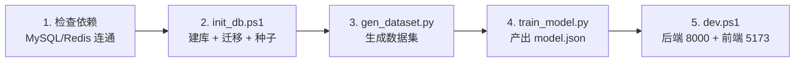

| 项 | 内容 |
| --- | --- |
| 环境变量（`.env`） | `DB_HOST/PORT/USER/PASSWORD/NAME`、`REDIS_HOST/PORT/DB`、`JWT_SECRET`、`API_KEY_SEED`、`LOG_LEVEL`、`FEATURE_WINDOW_PROFILE` |
| 启动命令 | `scripts/dev.ps1`（开发）、`uvicorn app.main:app --host 127.0.0.1 --port 8000`（后端单跑）、`npm run dev`（前端单跑） |
| 演示模式 | `npm run build` 后由 FastAPI 挂载 `frontend/dist`，单端口 8000 演示 |
| 数据迁移 | Alembic 版本化；`init_db.ps1` 幂等（重复执行不报错） |
| 回滚 | 代码回滚用 git；数据回滚＝重建 `risk_control` 库（独立库，不与其他库耦合），故不做向下迁移脚本 |
| 依赖前提 | 本地启动 MySQL 8.2 与 Redis 8.8；Python 3.12 项目内 `.venv` |

---

## 14. 测试架构

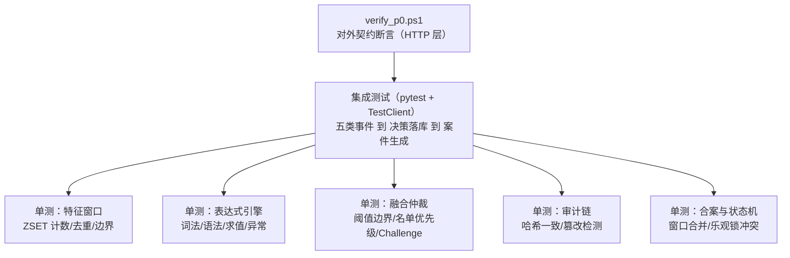

| 层 | 范围 | 工具 | 是否需真实 MySQL/Redis |
| --- | --- | --- | --- |
| 单元 | 表达式、融合、窗口计算、哈希链 | pytest | 否（fakeredis / 内存假实现） |
| 集成 | 事件接入 → 决策 → 落库 → 建案 | pytest + TestClient | 是（独立测试库 `risk_control_test`） |
| 契约 | P0 验收断言 | `scripts/verify_p0.ps1` | 是 |

测试数据隔离：集成测试使用独立库与独立 Redis DB（`DB=1`），用例按 `event_id` 前缀清理或事务回滚，不污染演示数据。

---

## 15. 架构决策记录（ADR 摘要）

| # | 决策 | 备选方案 | 选择理由 | 代价 |
| --- | --- | --- | --- | --- |
| 1 | 后端 Python + FastAPI | Java Spring Boot 3.2 / Node | 与训练脚本、数据生成同语言，特征定义单点维护 | 若团队以 Java 为主，迁移成本高 |
| 2 | MySQL 存事实 + Redis 存热数据 | 纯 MySQL / 引入 Kafka | 特征窗口是高频范围查询，MySQL 扛不住；Kafka 超出本期体量 | 多一个依赖，需处理 Redis 可丢性 |
| 3 | 决策同步返回 + 异步落库 | 全同步事务落库 | 保 P95 < 50ms；数据库抖动不影响判定可用性 | 大盘数据有短暂延迟 |
| 4 | 规则双模表达（树 ⇄ 文本）统一 AST | 纯结构化树 / 纯表达式 / JsonLogic 类库 | 兼顾可视化编辑与"表达式编辑"验收点，AST 单点可校验 | 自研词法/语法分析器的开发与测试成本 |
| 5 | 自研白名单求值器 | `eval()` / 第三方表达式库 | 无代码执行面，可单测，能产出全量求值链路 | 运算符表达能力受限（够用即可） |
| 6 | 模型＝离线脚本 + JSON 文件在线推理 | 模型服务（MLflow）/ 无模型 | 有真实训练与版本治理，零运维成本 | 不支持在线学习与自动重训 |
| 7 | 逻辑回归 | 深度模型 / 孤立森林上线 | 权重可读、贡献度可解释、推理毫秒级 | 表达能力弱于非线性模型 |
| 8 | Challenge 由规则显式声明 | 按分数区间隐式映射 | 策略师可控可预期 | 策略配置需多填一个字段 |
| 9 | 名单冲突按优先级可配，默认黑优先 | 白名单绝对优先 | 风险优先是风控常识，同时保留运营灵活性 | 需在界面讲清优先级语义 |
| 10 | 审计＝只增表 + DB 权限 + 触发器 + 哈希链 | 仅应用层日志 | 可现场演示篡改检测，是答辩亮点 | 写入需串行化，轻微影响吞吐（审计量小） |
| 11 | 合案按（主体, 场景）× 30 分钟窗口 | 一事一案 / 全主体合并 | 抑制案件风暴，又保持场景可分派 | 合案逻辑与并发控制更复杂 |
| 12 | 案件状态机含显式"接手" | 打开即视为审核中 | 表达多人协作语义，避免误触状态变更 | 多一步点击 |
| 13 | 单 worker 部署 | 多 worker + 分布式协调 | 单实例下审计串行、SSE 广播、规则缓存都最简单 | 无法水平扩展（本期非目标） |
| 14 | 前端 AntD 5 + TanStack Query + ECharts | 自研组件 / G6 图谱库 | 复用成熟组件与图表，精力集中在风控逻辑 | 包体较大，首屏需按需加载 |
| 15 | SSE 用 fetch 流式实现 | 原生 EventSource | 可携带 Authorization 头，token 不进 URL | 需手写解析与重连（约 60 行） |
| 16 | 仿真事件落库并标 `source` | 不落库 / 计入大盘 | 链路可回溯，又不污染大盘演示数据 | 所有统计口径需带 source 过滤条件 |

---

## 16. 演进路线与扩展点

| 阶段 | 架构增量 |
| --- | --- |
| **P0** | `sys_/biz_/rc_` 表 + 迁移；网关 → 特征 → 规则 → 模型 → 融合链路；异步落库 + 幂等 + 审计链；单测与集成测试 |
| **P1** | 案件服务（合案/状态机）+ 处置服务（业务联动）；前端骨架 + 登录 + 审核工作台三栏 |
| **P2** | 大盘（SSE + 预聚合）、策略配置（条件树编辑器）、仿真页（链路回溯）、审计与模型页 |
| **P3** | 数据集与两场景脚本、验收清单脚本化、README 演示手册 |

**未来的扩展点**（本期不做，但架构留了位置）：

| 扩展 | 触发条件 | 需要改什么 |
| --- | --- | --- |
| 多实例部署 | 单机 QPS 不足 | 审计串行改 DB 行锁；SSE 广播已走 Redis Pub/Sub 无需改；规则缓存改 Redis |
| 事件接入改消息队列 | 业务方要求异步投递、削峰 | 网关增加 MQ 消费者适配器，决策服务不变 |
| 特征存储独立化 | 特征维度爆发、需跨天聚合 | 引入专用特征存储；特征注册表增加 `source` 字段 |
| 模型服务化 | 需要多模型 A/B、在线学习 | `model_engine` 抽出 `Predictor` 接口，HTTP 实现替代本地文件实现 |
| 规则引擎升级 | 需要规则编排、灰度 | AST 之上加"规则组/策略集"层，命中链路已兼容 |

---

## 17. 风险与技术债

| # | 项 | 影响 | 计划 |
| --- | --- | --- | --- |
| 1 | 自研表达式引擎语法覆盖有限 | 复杂策略写不出 | 保持"够用"边界；扩展优先加运算符而非引入 eval |
| 2 | 异步落库导致大盘短时不一致 | 可能被追问数据准确性 | `/healthz` 暴露队列积压；大盘页标注"数据延迟 <1s" |
| 3 | 特征金额求和需拉取窗口成员 | 极端高频实体变慢 | 单实体窗口内事件量受生成器控制；必要时加"金额计数器 + 定期校准" |
| 4 | Redis 被当作可丢缓存 | 窗口丢失会低估风险分 | 提供重建脚本；响应携带 `feature_degraded` 标记 |
| 5 | 单 worker 无法水平扩展 | 容量上限锁定 | 明确为非目标；扩展路径见 §16 |
| 6 | 模型指标基于合成数据 | 指标偏乐观 | PRD 与页面均标注"合成数据训练，仅供演示" |
| 7 | 审计链校验是全量重算 | 记录多时校验变慢 | 本期审计量千级；扩展：分段校验 + 定期锚点哈希 |

---

## 18. 附：一次决策的完整数据落点

以 `order_create` 事件为例，说明"一个事件在系统里留下了什么"，便于排障时按图索骥：

| 落点 | 存储 | 内容 |
| --- | --- | --- |
| `rc_event` | MySQL | 事件信封 + payload + 来源 + 接收时间 |
| `rc:evt:*` | Redis | 该事件作为成员进入 user/device/ip/address/phone 各窗口条带 |
| `rc:idem:{event_id}` | Redis | 首判结果（TTL 24h） |
| `rc_feature_snapshot` | MySQL | 特征字典 + 耗时 + 特征版本 |
| `rc_decision` | MySQL | 三分 + 等级 + 动作 + 模型版本 + 耗时 |
| `rc_decision_hit` | MySQL | 每条规则的命中与原因 |
| `rc_model_contribution` | MySQL | 模型 top-5 贡献 |
| `rc_case` / `rc_case_event` | MySQL | 中高风险时建案/合案 |
| `rc_cnt:*` | Redis | 大盘计数桶 |
| `rc:sse:events` | Redis Pub/Sub | 广播给大盘滚屏 |
| `rc_audit_log` | MySQL | 系统动作（模型切换、名单变更）；人工处置另行写入 |

---

## 19. P0 落地记录（实现与设计的偏差）

本节记录 P0 实际编码时对本文档与 PRD 的**有意偏离**及其原因，避免后续维护者
把"实现与文档不一致"当成 bug 去改回来。

### 19.1 运行环境与工程化

| 项 | 结论 | 原因 |
| --- | --- | --- |
| `alembic.ini` 全 ASCII | 强制约定 | Windows 上 Alembic 用 `configparser` 读 ini，Python 3.12 的 `configparser` 走 `encoding="locale"`（zh-CN 下为 cp936），文件里任何中文注释都会让所有 alembic 命令 `UnicodeDecodeError`。故 ini 保持纯 ASCII，中文说明写在 `alembic/env.py` 与本文件。 |
| 连接串不写 ini | 强制约定 | 由 `alembic/env.py` 从 `app.core.config.settings` 读取（`backend/.env`，已 gitignore），保证"应用连哪个库、迁移就改哪个库"，口令不入库。 |
| 模型注释中的引号 | 用「」不用 `"` | 已在 `decision.py` / `sys.py` 各修复一处真实语法错误：`comment="…"如"…""` 会让 `.py` 直接 `SyntaxError`。这类错误只在首次真正 import 该包时暴露，`compileall` 能提前拦住。 |
| 建库逻辑 | `app/db/bootstrap.py` | `CREATE DATABASE` 必须连实例层级，而 SQLAlchemy engine 强制带库名；直连 PyMySQL 更直接，同时供测试夹具复用。库名做 `isalnum` 白名单校验防注入。 |

### 19.2 安全

| 变更 | 决策 |
| --- | --- |
| API Key 哈希 | bcrypt → **SHA-256**（列由 `VARCHAR(128)` 收窄为 `VARCHAR(64)` 并加唯一索引）。理由：高熵随机串无需慢哈希，而 bcrypt 每次约 250ms 会加在**每一次事件接入**上，直接违背 §12 P95 指标；确定性摘要还允许按哈希等值查找。 |
| 审计触发器 | 已随迁移创建，对所有账号生效（含 root）。演示"链断裂"需先 `DROP TRIGGER` → 篡改 → 校验 → 重建。 |
| `INSERT/SELECT` 授权层 | **当前未生效**（以 root 连接），已知限制。纵深防御剩余两层（触发器、哈希链）均可用。 |

### 19.3 配置

`sys_config` 的 8 个键以 `app/services/config_service.py` 的 `CONFIG_SPECS` 为唯一权威定义，
种子（`app/seeds/configs.py`）由注册表自动生成，避免"注册表与种子漂移"。
读取侧带 10 秒进程内缓存，写侧 `invalidate_cache()` 保证"保存即生效"。

### 19.4 已完成与未完成

| 状态 | 内容 |
| --- | --- |
| ✅ 已完成 | 依赖安装与 `.venv`；建库/迁移/种子三段式初始化；18 张 P0 表 + 审计只增触发器；3 账号 / 8 配置 / 20 规则 / API Key 种子；`/healthz`（MySQL 8.2 + Redis 8.8 均 ok）；`alembic check` 无漂移；表达式引擎（61 项测试）；服务层（名单/特征/规则/模型/融合/审计）；事件网关 + `POST /api/v1/events`、`/events/batch`（X-API-Key）；`POST /api/v1/auth/login`、`GET /api/v1/auth/me`（JWT）；模拟业务端 `app/simulator/`（主体生成器 + 五类业务动作 + 三个作弊场景 + CLI，见 §19.6）；188 项 pytest 全绿（含 4 项场景回归、13 项数据集规划断言）；数据集生成/标定/训练 & 建模/登记一条龙（`gen_dataset.py` / `calibrate_dataset.py` / `train_model.py` / `verify_model_quality.py`，见 §19.7）、`rebuild_windows.py` / `dev.ps1` / `verify_p0.ps1`（10 项断言全绿）、`app/db/migrate.py`（建表迁移统一入口）、`docs/P0-验收清单.md` |
| ○ 未完成 | `replay_write_failures.py`（**推迟**：P0 采用同步事务提交，没有"落库失败待补偿"窗口，见 §19.5）；前端（P1 起） |

### 19.5 事件网关的落地偏差（P0）

| 项 | 设计稿 | P0 实装 | 原因与代价 |
| --- | --- | --- | --- |
| 落库时机 | §5.1：同步段只碰内存与 Redis，MySQL 写入走写回队列（失败重试 3 次 + `write_failure.log` + 重放脚本） | **同步事务提交**，成功后才写条带与幂等缓存 | 单进程演示系统，本地写 5 张表约 5~15ms，仍在 §12 的 P95 预算内；而写回队列会引入"响应成功但库里没有"的窗口，且踩坑记录表明 MySQL 元数据锁问题在异步路径上极难定位。**代价**：事件接入与 MySQL 可用性耦合（MySQL 挂 → 接入失败而非"先收后补"）。`replay_write_failures.py` 因此推迟到引入队列时再实装。 |
| 条带 member 格式 | §6.2：`{ts_ms}\|{event_id}\|{amount}`（3 段），聚簇特征靠 `{prefix}:{subject}` 覆盖 `event_id` 位 | **4 段**：`{ts_ms}\|{event_id}\|{amount}\|{subject}` | 3 段方案下同一个键（如 `rc:evt:device:D1:coupon_receive:1h`）要同时服务"计数"与"主体去重"，覆盖式写法会让**计数翻倍**（`device_coupon_cnt_1h` 把 3 次算成 6 次，规则阈值静默减半）。4 段方案一个事件一个成员，计数与去重各取所需，且向后兼容 3 段旧成员。 |
| 特征快照的内容 | §7.3：快照是"扁平键值" | **只含注册表声明过的键**；响应把"参与打分的特征"与"仅供核对的事实"拆成 `features` / `context` 两个字段 | 把 payload、设备指纹等原始事实混进快照，会让模型向量与训练列集合随事件类型漂移，且审核员无法区分"这个键影响了决策"与"这个键只是被展示"。`feature_engine.split_context()` 负责拆分，出现未注册键时记 WARNING。 |
| 计数类特征是否含当前事件 | §7.1 未明确 | 当前事件在其**涉及的每个维度**上的 `*_cnt` 都 **+1**（`_compute_current_event_counts`） | 条带写入发生在决策之后，不补偿则每条链路**第一条事件**的频次恒为 0，且"设备/地址维度永远少 1 次"是永久性的 —— `device_coupon_cnt_1h > 5` 这类规则会一直差一次才命中，全程无报错。金额求和（`_compute_sum`）与主体去重本就已补偿，此处是补齐一致性。 |
| 跨事件类型的主体去重 | §7.3 未明确 | 由 `window_store.distinct_subjects` 一次取多类型条带后**合并去重** | 同一账号可能同时有登录与领券事件；逐类型相加会把它数两次（"同设备 3 个账号"变成 6 个），属于同一类"无报错的阈值失效"。 |
| 名单标记的特征声明 | §7.2 未单列 | 键名下沉到 `app/services/flags.py`，声明由 `list_service.LIST_FLAG_SPECS` 提供 | `feature_engine` 与 `list_service` 互相需要对方的定义（前者要键名、后者要 `FeatureSpec`），把共用常量下沉到叶子模块是解开循环依赖的最小改动。 |
| `JWT_SECRET` 长度 | §10 未规定 | 签发前校验 HS256 密钥 ≥ 32 字节，不足直接抛错 | PyJWT 对短密钥每次都打 `InsecureKeyLengthWarning`，告警刷屏会掩盖真正需要关注的安全提示；把"配置不合格"提前到签发期比运行期告警更有用。 |
| 案件编号 | §9.1：中高风险自动建案 | P0 **不建案**，`case_no` 留空并在 `notes` 说明 | `rc_case` 属 P1（案件流转与工作台同期交付）。留空 + 显式说明优于"写一个查不到的案件号"。 |
| 未知特征字段 | §7.2 要求"规则引用未知字段应在保存时拦住" | 求值期宽容（判 false）并计入响应的 `missing_fields` + WARNING 日志；硬拦截留给 P2 的规则保存接口（`known_feature_keys()` 已就绪） | P0 没有规则编辑入口，唯一的写入方是种子数据（已由 `validate_node` 校验）。为"没有写入口的路径"提前建表存疑键，收益低于维护成本。 |

### 19.6 模拟业务端与场景的落地记录（P0）

模拟业务端是 P0 的**验收载体**：它按真实接入方式调用事件网关，`Reject` 时不落业务单据（券没发出去、订单没建），
因此"风控是否真的影响了业务"是可验证的，而不是只看响应体。

三个场景的预期结论与断言口径：

| 场景 | 剧本 | 预期 | 断言（`ScenarioReport.check()`） |
| --- | --- | --- | --- |
| `coupon_farm` | 42 个新账号共用 5 台设备 + 3 个代理 IP 批量领券；混入 2 个"环境干净"的隐蔽账号做对照 | 农场账号 `Reject`；隐蔽账号放行（单一弱信号不足以定级） | 出现 Reject，且命中 `RC_ENV_001`（设备环境风险）与 `RC_FREQ_001`（同设备账号聚集） |
| `refund_fraud` | 4 个老账号 6 天前共用同一收货地址各自退款，主账号再于 24 小时内对 3 笔高额订单申请"未收到货" | 前两笔退款放行、第 3 笔进人审（`Review`） | 出现 Review，命中 `RC_AMT_003` / `RC_AS_002` / `RC_AS_004`，且主账号退款分数**逐笔升级** |
| `normal_day` | 30 个正常用户的一天：登录 / 领券 / 下单 / 支付 | 全部放行 | 出现 Pass，且**不得出现 Reject**（误拦基线） |

四处落地决定与踩坑（都属于"不报错的失效"，记录下来避免回退）：

| 项 | 决定 | 原因与代价 |
| --- | --- | --- |
| 业务号/事件号生成 | `前缀 + 事件时刻 + 进程盐 + 进程内全局序号`（`service._NO_SALT` / `_NO_COUNTER`） | 原实现是"秒级时间戳 + **实例内**自增"，而每个场景各建一个 `BusinessSimulator`，同一秒内两个实例都从 1 开始计数 → 生成**完全相同的号**。业务单号撞 `uq_biz_order_order_no` 直接抛 IntegrityError；事件号撞车更隐蔽：后来者被幂等缓存当成重复投递，回放上一条事件的决策，整条事件静默丢失。进程盐**不能用 PID**（操作系统会复用，而号里的时间戳取的是事件自身时刻、重跑时天然对齐），改用 4 字节随机盐。 |
| 决策号生成 | `D + 秒级时刻 + 进程盐 + 6 位自增序号`（`event_gateway.new_decision_id`） | 原实现是"秒级时间戳 + 3 位随机后缀"，而 `utcnow()` 刻意截掉微秒（审计链按秒归一），于是同一秒内约 40 条决策就开始撞唯一索引（生日悖论：140 条时撞车概率≈99%）。撞车的表现极具误导性——网关把 IntegrityError 一律译成"事件编号已存在（并发重复投递）"，而真正重复的是决策号，调用方改 `event_id` 重试照样失败。现已按约束名分两类翻译：事件号冲突→409，决策号冲突→500 + ERROR 日志。 |
| 场景可重跑性 | 账号号段按秒自动分配（`scenarios._batch_index`，`prefix_index` 仍可显式覆盖）；`BusinessSimulator.register()` 支持指定注册时间 | 固定号段意味着第二次运行与第一次**是同一批账号**：条带里的历史事件直接叠加，`account_age_days` 不再为 0，新账号类规则静默失效——同一脚本第一次 Reject、第二次 Pass。批次自动错开后，重复运行结论一致（PRD §14.1 的"可复现"）。 |
| 规则权重与 PRD §14.3 对齐 | `RC_AS_002` 条件改为 `user_refund_cnt_24h >= 3`（原"退款率≥50% 且 24h 订单≥4"）；`RC_AS_004` 分值 25 → 15 | PRD §14.3 写明的命中路径是"24h 退款笔数 + 金额 + 地址聚集"，但种子规则里**没有**任何规则引用 `user_refund_cnt_24h`，实现与文档口径脱节（退款率与连续退款高度相关，两条同时计分等于把同一事实算两遍）。改后 RS_AS 三件套 = 30+15+30 = 75，正好落在 PRD 要求的 60~79 人审区间；旧口径则是 80（Reject），与 PRD 的"Review 建案"结论相反。场景断言（`expect_rules`）就是为了钉住这条路径。 |

### 19.7 数据集生成器的落地记录（P0）

数据集生成器是"**模型好不好用**"的唯一来源，也是本项目最容易做出**假成绩**的地方 ——
一条自我欺骗的捷径是：把作弊账号画得处处不同，然后收获一个 AUC=1.0 的模型。
本项目**真的走了一次这条弯路**，下面是完整的记录，供后续阶段与答辩直接引用。

**先看事故现场**：第一版生成器的模型评估结果是 AUC 1.0000 / KS 1.0000 / precision@100 1.0000。
真实风控模型 AUC 通常在 0.8~0.95，1.0 只意味着一件事 —— **标签泄漏**：
模型能重新推导出"这个账号是作弊账号"这个元信息，而不是学到行为规律。

**归因（靠数据，不靠猜）**：逐特征单变量 AUC + 按画像的分数分布，定位到**每一个作弊画像
都能被单个特征阈值一刀切分开**：

| 泄露源 | 现象（实测） | 根因 |
| --- | --- | --- |
| 农场设备 | `device_new_account_ratio_24h` 权重 +2.49，`device_env_risk` 正常账号恒为 0 | 正常用户里**没有**共用设备的人，也没有环境半可疑的人 |
| 退款团伙地址 | `address_account_cnt_7d` 权重 +3.74（全场共用 1 个地址 = 21 个账号） | 团伙只有一个收货点；正常用户一人一地址 |
| 账号年龄 | `account_age_days` 作弊均值 104 天 vs 正常 469 天（单特征 AUC 0.895） | 正常账号清一色老账号（30~900 天均匀分布），没有"新注册用户"这一群 |
| 领取频次 | `user_coupon_cnt_1h` 作弊恒为 6、正常 ≤1 | 没有"领券党"这类**合法但行为相似**的用户 |
| 退款率方向反了 | `address_refund_rate_7d` 权重 **−1.54**（作弊 0.40 < 正常 0.44） | 见下方第 6 条：PRD 口径强制"60% 订单退款"，正常用户比作弊账号更爱退款 |
| 代理 IP | `ip_account_cnt_24h` 单特征 AUC 0.89 | 整个农场只有 3 个代理出口，"这些 IP 就是作弊 IP"等价于标签 |

**六项保真度修法**（全部在 `app/simulator/dataset.py` / `actors.py`，逐条都能单测核验）：

1. **正常账号里混入"环境可疑但合法"的用户组**（`_NORMAL_SUSPICIOUS_SHARE = 0.18`）：
   合租房共用设备与收货地址（每组 3~8 人），组里每 4 人掺一个"刚注册的新成员"，
   让"共用设备"与"新账号"两个信号能独立出现。
2. **正常账号里混入"半可疑环境"**（`_NORMAL_RISKY_ENV_SHARE = 0.06` +
   `RISKY_NORMAL_FINGERPRINTS`）：Root 玩机、云手机、多开、改定位插件，`device_env_risk`
   取 10~70 分，与农场（70~95）重叠 —— 环境分因此只能是"需要进一步核实"的信号。
3. **正常账号里混入"领券党"**（`_NORMAL_COUPON_HUNTER_SHARE = 0.12`）：一次登录连领 3~7 张、
   偏好大额券，日累计领券量与"隐蔽型薅羊毛账号"落在同一量级；区别只在**领完之后有没有正常消费**。
   同理混入"走 VPN/企业出口的合法用户"（`_NORMAL_VPN_SHARE = 0.04`），
   否则 `ip_is_datacenter` 与 `ip_region_mismatch` 就是"命中即作弊"。
4. **给作弊账号加"掩护行为"**（`_CHEAT_COVER_SHARE`：农场/隐蔽 50%、退款 30%）：
   真实黑产会**养号** —— 一边刷券一边像普通用户那样浏览下单。没有这部分时，
   作弊账号的每一个事件在特征空间里都是极端值，模型只要看单个特征的高分位就能全部分开。
   副作用是**标签噪声**（作弊账号的正常浏览事件在账号级标签下仍标为作弊），
   这在真实系统里本来如此：人工封禁一个账号时，它过去一个月的正常消费记录也一并进了黑样本。
5. **账面价值特征的异质性**：三个作弊画像内部不再各自"完全一致" —— 农场账号里每 5 个
   有 2 个直接挂家宽出口（不用代理）、团伙地址改成 5 人一组（与正常合租组重叠）、
   券面额正常用户与作弊账号共用同一套权重表、订单金额给正常用户一条延伸到 9000 元的长尾
   （作弊账号专挑 1200~8000 元高价值商品，区间重叠）。
6. **承认一条规格层面的约束（未修，已登记）**：PRD §14.1 同时规定"支付 15%、售后 12%"，
   即 **售后/支付 = 0.8**，等价于"60% 的订单都发生退款"。这是口径选择而非业务直觉
   （真实自然退款率 1%~3%），代价是 `*_refund_rate` 类特征在正常账号上也有 0.5~0.6、
   与"恶意退款"画像的 1.0 部分重叠，判别力被压缩。
   **要修就必须改 PRD §14.1 的分布**（把售后降到约 5%），属于产品决策，因此本阶段只登记不改。

**改后的结果**（5 万事件配额 / 800 账号 / 70 作弊 / 14 天，
seed `20260923` + `--end 2026-09-23T12:00:00Z`，实测 51,003 条事件）：

| 指标 | 修法前 | 修法后 |
| --- | --- | --- |
| 验证集 AUC | 1.0000 | **0.8772** |
| KS | 1.0000 | 0.6238 |
| precision@100 | 1.0000 | 0.72 |
| 正常事件 ≥60 分占比 | —（无意义） | 6.9% |
| 作弊事件 ≥60 分占比 | —（无意义） | 87.6% |

**训练脚本里的三道自检**（把这次事故变成可自动拦截的机制，`scripts/train_model.py`）：

| 自检 | 触发条件 | 拦下的问题 |
| --- | --- | --- |
| 特征名对照注册表 | 任意特征名不在 `FEATURE_REGISTRY` | 拼错的特征名会被当缺失值、权重静默失效 |
| 缺失率告警 | 某特征缺失率 > 50% | 权重建在均值填充之上（等于没学） |
| 泄漏探针 | AUC ≥ 0.995 **且** 某特征 \|权重\| ≥ 3.0 | "生成器把两类画得太开"这类标签泄漏 |

**训练与推理的缺失口径必须一致**：缺失格在训练侧和推理侧都取 **z = 0**（即
``model_engine.predict`` 对缺失特征不打分），训练脚本的 `_to_z` 同样把 NaN 置 0。
历史上曾出现"训练按原始均值填充、推理取 z = 0"的口径错位 —— 填充值经 log1p + z-score
后落在分布之外，训练学到的偏移在推理时不成立。这类错误不会报错，
只会让所有分数系统性偏移；因此两边的缺失口径在代码层面只保留**一个实现**
（`scripts/train_model.py` 的 `_to_z` 与 `model_engine.predict` 逐字对齐）。

**可复现性要固定两个参数**：生成器的随机种子由 `--seed` 决定，而时间线还取决于
右端点（``--end``，留空时 = 运行时刻）。若固定了种子却用运行时刻当右端点，
"同一 seed 在不同日期、不同时段重跑"会得到不同的绝对时间 —— 
``night_activity_ratio`` 这类特征按**小时**切分，事件落在几点会直接改变特征值与模型指标。
要复跑出同一份数据集，seed 与 `--end` 必须同时写死（例子：`--end 2026-09-23T12:00:00Z`）。

**建表路径只有一条**：数据集生成与开发库初始化都走 `app.db.migrate.upgrade_to_head`
（alembic 迁移），不允许用 `Base.metadata.create_all`。后者建出的表缺迁移里
用 `op.execute` 写的对象（如"审计只增"触发器），于是数据集库与开发库表名相同、
行为不同；这类差异在训练阶段不可见，只在演示或回滚时才显现。

**训练库 ≠ 推理库**（新增 `--register-only`）：标签只存在于数据集库，推理发生在演示库，
而 `rc_model_version` 是每库一张表。产物文件 `backend/models_artifacts/model_v1.json` 跨库共享，
演示库用 `train_model.py --db-name risk_control --version v1 --register-only` 登记即可。
登记时会校验"产物特征名**与顺序** == `FEATURE_NAMES`"：顺序错一位等价于把 A 的权重按在 B 上，
而结果仍然是一个像模像样的分数（属于最危险的一类静默错误）。

**特征共线性（解读贡献度时必须知道的边界）**：`user_coupon_cnt_1h` 与 `device_coupon_cnt_1h`
在数据里高度相关，线性模型会把权重摊到两者身上、符号甚至相反（实测前者 −1.64）。
因此页面上的"贡献度 Top5"只能读作**该模型在这个组合下对这条事件的边际贡献**，
不能当作"领券多所以风险低"的因果结论。要给出因果式解释，需要做单特征 AUC 对照
（或改用带约束的模型），这属于 P2 模型页的展示口径问题。

**其他两处生成器踩坑**（都是"不报错的失效"）：

| 项 | 现象 | 修法 |
| --- | --- | --- |
| 时间线自相矛盾 | 攻击时刻随机散落，出现"事件早于注册"→ `account_age_days` 算出**负年龄**并被记为缺失（实测 27 条） | 农场注册时刻改为"首轮开工前 1~6 小时"；冒烟脚本核对"早于注册的事件数 = 0" |
| 同设备账号不同时开工 | 同设备账号随机散落 14 天，任意 24h 窗口内每台设备只有 1 个账号 → `device_account_cnt_24h` 聚类信号自己消失 | 农场**按设备分组排班**（`_group_by_device`）：同组账号在同一个 90 分钟窗口内开工 |

**复跑入口**：`scripts/calibrate_dataset.py`（分布标定，秒级）→
`scripts/gen_dataset.py --reset --end <ISO8601>`（约 20 分钟）→
`scripts/train_model.py --version v1` → `scripts/verify_model_quality.py`（只读核对）。
数据集必须走**真实事件网关**而不是直接写表：训练特征与线上特征必须同源，
自己另写一套聚合逻辑会得到一份"离线 AUC 很好看、线上权重全偏"的模型，
而这类问题在演示里几乎不可能被发现（页面照样显示分数，只是分数没有意义）。

### 19.8 案件流转的落地记录（P1）

P1 交付物：案件四表 + 合案 + 状态机 + 处置联动 + 五个案件接口 + `verify_p1.ps1`（36 项断言）。
实现落在 `app/models/case.py`、`app/services/case_service.py`、
`app/services/disposal_service.py`、`app/api/cases.py`，迁移 `7e9dc8ec3f41`。

| 项 | 设计稿 | P1 实装 | 原因与代价 |
| --- | --- | --- | --- |
| 案件编号 | §7.6 初稿：`RC{yyyyMMdd}{6位序列}` | `C{yyyyMMddHHMMSS}{进程盐}{6位序号}`（`case_service.new_case_no`） | 日内序列需要一个跨请求的计数器且要防并发；而"时刻 + 进程盐 + 自增"这套方案已在决策编号上验证过（§19.5 的撞号事故）。两处编号同构，排查时不需要再记第二套规则。 |
| 合案窗口锚点 | §7.6 初稿：`last_at >= now - window` | `last_at >= occurred_at - window`，且 `last_at = GREATEST(last_at, occurred_at)` | 见 §7.6 的两点修正：窗口属于业务时间语义，且补投递不能让末次触发时间倒退。 |
| 合案并发 | §7.6 初稿：`SELECT ... FOR UPDATE` | 进程内按 `(主体, 场景)` 加锁 + `FOR UPDATE` + 原子累加 | 行锁锁不住"候选不存在"的窗口，那正是批量灌事件时重复建案的高发点。代价：多进程部署下仍可能重复建案（单实例部署的前置假设与审计哈希链一致）。 |
| 合案是否写审计 | §10.1 审计范围未列 | **建案写**（`case_create`，actor=system），**合案不写** | 合案发生在决策热路径上，同一主体一分钟可能合几十次；审计写入是全局串行（哈希链要求），逐次写会让它成为吞吐瓶颈。合案痕迹由 `rc_case_event` 承担（时间线上可见），信息没有丢。 |
| `hit_cnt` / `event_cnt` 口径 | §9.1 只写"两者都 +1" | `event_cnt` = 关联事件数；`hit_cnt` = 累计命中规则条数 | 合成一个字段后，工作台无法回答"是一次触发踩了 3 条规则，还是触发了 3 次"。 |
| 处置权限 | §9.2：`processing → disposed` 触发者为当前 handler | 当前 handler；**admin 例外**（可直接处置 pending，也可处置他人案件） | 权限矩阵里 admin 涵盖一切；若限制 admin 只能处置自己接手的案件，演练中"管理员清理现场"会被状态机卡住。审计里 `actor_name` 与普通审核员可区分。 |
| 处置联动失败 | §9.4：联动失败不阻塞提交 | 逐项 `exec_result = success/failed/skipped` + 原因落 `rc_case_action_item`，**HTTP 仍 200** | 用 5xx 表达"订单已被客服先一步取消"会把一次有效的处置变成错误，而审核员的研判结论本身是成功的。`skipped` 与 `failed` 分开：前者是"前置不满足"（无订单、订单已支付），后者是"数据不一致"（单号存在但查不到）。 |
| 名单写入方式 | 未规定 | `INSERT IGNORE`（唯一键 `(list_type, dimension, value)` 兜底） | 重复处置（窗口外新建的第二个案件再次勾选拉黑）不该报 409；副作用是已存在时不更新 `reason` —— 名单原因是"当时为什么写"，不是编辑记录，要看变更应看审计。 |
| 归档批量语义 | §9.2：admin 归档（支持批量） | `POST /cases/archive` 逐条独立判定，响应恒 200 + `results[]` | 与 `events/batch` 同一口径：把 10 条里的 1 条状态不符变成整批失败，会让操作者反复重试并最终手工逐条点。 |
| 处置前置校验顺序 | 未规定 | **状态先于权限** | 踩过：pending 案件的 `handler_id` 为空，先判"非当前处理人"会让没接手的审核员收到 40302"只有当前处理人才能处置"，而他真正的问题是"还没接手"。错误码指错方向，前端只能显示一句与操作无关的提示。 |
| `subject_case_cnt` 特征 | §7.2 注册表标注"（P1 案件表就绪后接入）" | **已接真实 `rc_case` 计数**（近 30 天，含已处置/已归档） | P0 期它恒为 0 并记 `missing_fields`，引用它的规则永远不触发而页面上看不出异常。P1 接上后同一个规则"无需改动就开始工作"，这正是当初允许"引用未就绪字段"的意义。 |

**P1 的验收证据**：`pwsh -File scripts/verify_p1.ps1`（36 项断言）——
业务动作经模拟业务端注入 → 第 5 笔订单进入 Review 并建案 → 工作台查看证据链 →
接手 → 处置（拦截订单 + 拉黑账号）→ 订单真的变 `cancelled`、名单真的写入 →
管理员归档 → 审计哈希链校验通过。另加 244 项 pytest（其中 56 项为案件域新增）。

**P1 未完成部分**：审核工作台前端（PRD §11.3 的三栏交互）仍为设计系统骨架，
真实接口联调列为 P1-b；`rc_case` 的"超时未处置自动提醒"、多进程合案的正解（活跃案件唯一键）、
处置撤销（改判）均在 P2 之后评估。
